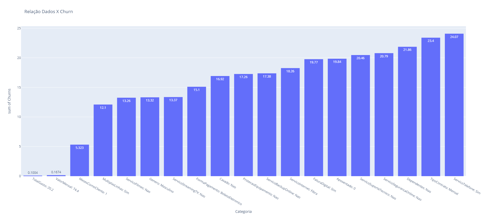

# hashtag-pyhon
Repositório para as aulas do intensivão de Python da hashtag cursos

## Aula 01 - Automação de Tarefas

 - Branch `aula-01`
 - Abre o navegador e abre um vídeo no YouTube

## Aula 02 - Análise de Dados
 - Branch `aula-02`
 - Analisa base de dados para avaliar as categorias onde ocorreram `churns` na empresa.

 

 - Cria gráfico contendo o valor bruto recebido com base no sistema de MSC da Trybe